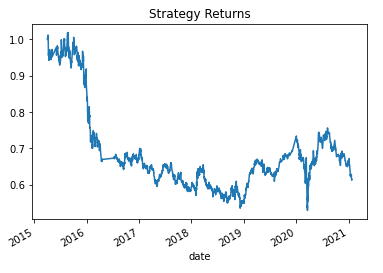
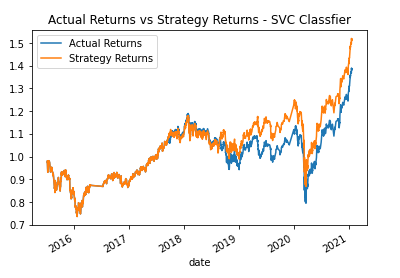
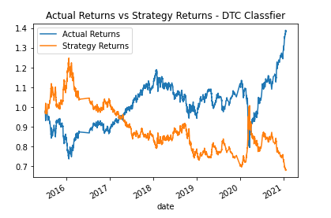

# Algorithmic_trading_exercise
This code will allow you to implement algorithmic trading strategies with machine learning in order to automate trading decisions. In this exercise, data is used to help a financial advisory firm improve their existing trading signals with machine learning algoriths that will be able to adapt to newly generated data. 

 

## Technologies

This project leverages python 3.7 with Jupyter Notebook.

 

## Installation Guide

Before running the application first import the following.  

import pandas as pd 
import numpy as np 
from pathlib import Path 
import hvplot.pandas 
import matplotlib.pyplot as plt 
from sklearn import svm 
from sklearn.preprocessing import StandardScaler 
from pandas.tseries.offsets import DateOffset 
from sklearn.metrics import classification_report 
 

## Findings/Analysis 

The provided data was first loaded into a data frame and the rest of the provided data was ran in order to find the signals dataframe and generate the SMA_Fast and SMA_Slow columns. The first graph that was created was used to visualize the firms existing strategy returns, shown below.
  

I then used the SVC classifier model in order to run a new model with different predictions, shown below.
  

A third model was also created. Instead of using the SVC classfier, I opted to use the Decision Tree Classifier, shown below.
  

In conclusion, the SVC classifier is definitely the most accurate in terms of modeling predictions compared to that of the Decision Tree Classifier. Using the Decision Tree method, the data was extremely volatile compared to the strategy line and seems like a bad classifier to use as a testing method. I would stick to using the SVC classifier or test other classifiers instead of using DTC. 

## Contributors

Jeffrey Liu : Dev
UCB Fintech - Provided initial resources

 
## License
Trilogy Technology 
UCB Fintech Extension Program

